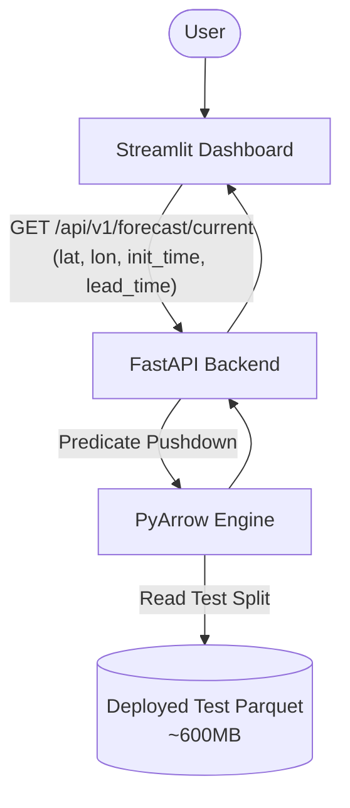

# VHI-RAM: Hybrid Forecast Arbitration


VHI-RAM is an **Adaptive AI-NWP Multi-Model Forecast Blending System** developed for SIH 2026. It serves as a hybrid arbitration layer that evaluates competing forecast sources (e.g., IFS HRES vs. Pangu-Weather) and assigns confidence based on predicted error, extreme-event risk, and empirical uncertainty.

> **Current Status**: This repository contains the **Historical/Precomputed Evaluation Prototype**. It is designed to validate the core multi-model arbitration logic against WeatherBench 2 derived historical datasets (ERA5, IFS HRES, Pangu-Weather). 

🔗 **Live Public Demo**: [VHI-RAM on Streamlit Community Cloud](https://vhi-ram-hb3wt77gwpjhtwpna96idt.streamlit.app)

---

## 🎯 SIH / Project Value
While individual weather models continuously improve, they exhibit unique biases and structural errors depending on the region, weather regime, and lead time. VHI-RAM addresses this by:
- **Multi-model arbitration**: Dynamically switching between physics-based (NWP) and data-driven (AI) models based on predicted absolute error.
- **Uncertainty-aware support**: Utilizing empirical uncertainty calibration to bound the forecast.
- **Extreme Heat Risk**: Classifying extreme events via calibrated machine learning.

*Note: This is an evaluation prototype using static historical test data to prove the arbitration concept, rather than an operational live-inference engine.*

---

## 🏗️ Architecture (Current Prototype)

The current application operates as a decoupled frontend/backend system, both hosted within a single Streamlit Community Cloud container for the public demo.



### Components
1. **Model Arbitration / Gating**: LightGBM-based gating predicting absolute error to dynamically blend HRES and Pangu-Weather.
2. **Extreme Heat Classification**: A LightGBM classifier with isotonic calibration identifying heat extremes.
3. **Data Layer**: PyArrow predicate-pushdown querying over a `.parquet` store.

---

## 📂 Repository Structure

```text
├── artifacts/             # Trained ML models and evaluation metrics
├── configs/               # Experiment and schema configurations
├── data/                  
│   ├── index/             # case_metadata.json for dynamic UI selectors
│   └── probabilistic/     # Data files (test parquet deployed via LFS)
├── docs/                  # Project documentation (Architecture, Design)
├── scripts/               # Data acquisition, inspection, and training scripts
├── src/blend/             # Main application package
│   ├── api/app.py         # FastAPI backend
│   ├── dashboard/app.py   # Streamlit frontend
│   ├── extremes/          # Heat risk classification logic
│   ├── probabilistic/     # Uncertainty processing
│   └── weights/           # Arbitration gating logic
├── tests/                 # Unit and integration tests
├── requirements.txt       # Project dependencies
└── start.sh               # Local multi-process launch script
```

---

## 💿 Dataset & Git LFS

The system evaluates forecasts using **WeatherBench 2**, utilizing ERA5 (ground truth), IFS HRES, and Pangu-Weather.

- **Master Dataset**: The full probabilistic dataset is ~3.6 GB and is intentionally **excluded** from Git tracking (`.gitignore`).
- **Deployment Dataset**: We use Git LFS to track `data/probabilistic/probabilistic_forecasts_test.parquet` (~603 MB, 8.6M rows), which exclusively contains the `test` data split needed for the dashboard.
- **Verified Variable**: The currently evaluated metric is 2-meter temperature.

---

## 🚀 Local Setup

To run the application locally:

**1. Clone the repository**
```bash
git clone https://github.com/vampsheretocode/VHI-RAM.git
cd VHI-RAM
```
*(Ensure Git LFS is installed to successfully pull the 600MB test parquet).*

**2. Create and activate a virtual environment**
```bash
# Windows
python -m venv venv
.\venv\Scripts\activate

# Linux/Mac
python3 -m venv venv
source venv/bin/activate
```

**3. Install dependencies**
```bash
pip install -r requirements.txt
```

**4. Run the application**
You can start the system using the provided script (Linux/Mac):
```bash
bash start.sh
```
Or manually run the frontend (which natively spawns the FastAPI backend via `sys.executable`):
```bash
python -m streamlit run src/blend/dashboard/app.py
```

---

## 🕹️ Dashboard & Verified Reference Case

The dashboard dynamically populates case selectors via `data/index/case_metadata.json`. If a queried case does not exist in the test split, the backend yields a safe 404 response rather than silently returning incorrect data.

**Reference Regression Case:**
- **Latitude**: `17.75`
- **Longitude**: `68.25`
- **Init Time**: `2020-11-01 00:00:00`
- **Lead Time (Hours)**: `120`

*Expected Verified Output:*
- **P50 (Median)**: `301.30 K` / `28.15 °C`
- **P10**: `300.60 K` / `27.45 °C`
- **P90**: `302.78 K` / `29.63 °C`

*(While temperatures are displayed in Celsius for UX, Kelvin remains the underlying scientific standard across the codebase).*

---

## 📡 API Reference

The FastAPI backend exposes endpoints for the dashboard.

### `GET /api/v1/forecast/current`
Fetches probabilistic forecast metrics and extreme risk analysis for a specific coordinate and time.

**Parameters:**
- `lat` (float): Latitude
- `lon` (float): Longitude
- `init_time` (str): Initialization time (e.g., `2020-11-01 00:00:00`)
- `lead_time` (int): Lead time in hours

**Example Request:**
```bash
curl "http://localhost:8000/api/v1/forecast/current?lat=17.75&lon=68.25&init_time=2020-11-01%2000:00:00&lead_time=120"
```

Interactive API documentation (Swagger) is available at `http://localhost:8000/docs` when running the backend locally.

---

## 🚧 Current Limitations

- **Precomputed Data Scope**: This prototype evaluates model blending on a static historical test-split rather than streaming live meteorological data.
- **Inference Pipeline**: The ML models (arbitration gating, extreme classifiers) are executed against pre-extracted test arrays; runtime inference over raw GRIB/NetCDF inputs is not yet integrated.
- **Cloud Constraints**: The public Streamlit Community Cloud deployment utilizes 1GB RAM, necessitating strict PyArrow predicate pushdown rather than in-memory pandas operations.

---

## 🗺️ Roadmap (Future Work)

- **Live Data Ingestion**: Transition from WeatherBench 2 static archives to ECMWF/NOAA live data APIs.
- **Operational Runtime Inference**: Execute the LightGBM arbitration models on the fly as new NWP/AI forecasts arrive.
- **Expanded Variables**: Extend blending mechanics to precipitation, wind speed, and geopotential height.
- **Broader Domains**: Expand spatial evaluation beyond the India regional bounding box.
- **Production Infrastructure**: Migrate from local Parquet files to a scalable cloud database or distributed Zarr cluster.
